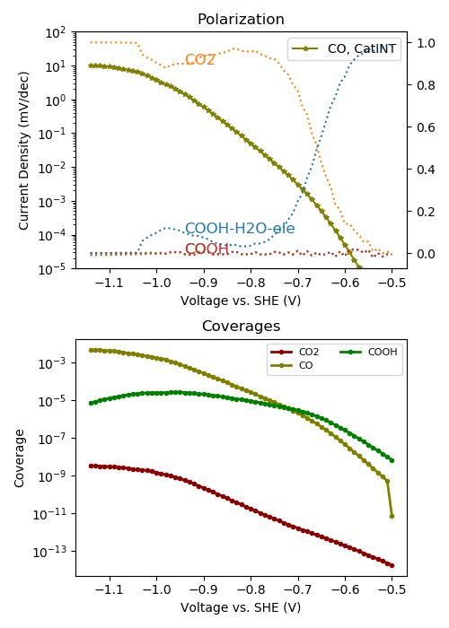

Analyzing the results
---------------------

Polarization curve and coverages
~~~~~~~~~~~~~~~~~~~~~~~~~~~~~~~~

We first analyze the results, by using the ``$CATINT/tools/plotting_catmap.py`` utility. We call

.. code:: python

    python $CATINT/tools/plotting_catmap.py --file CO2R_results --scale SHE --expdata\
        --product CO --exp_add_pH 7.2 --system pc-Au --fit_tafel --exp_colormode dataset

The command plots the current density and coverages of the calculation. Experimental data can be added, if placed into the ``$CATINT/data/CO2R/CSV`` folder in the form of CSV files folder in the form of CSV files (here we use the digitized and original data of various references which is not publically available). In case experimental data has been placed into the folder, the ``$CATINT/catint/experimental.py`` file also needs to be modified, so that this data is considered. Then the data can be plotted by invoking the above command using also the ``--expdata`` keyword. The experimental data is filtered with respect to the simulated pH. Data for different pH values can also be plotted using the ``--exp_add_pH`` argument. ``--system`` specifies the system for which experimental data will be searched for, ``--product`` filters the product for which experimental partial current densites should be plotted. ``--exp_colormode`` defines how to color the experimental data curves, the possible options are ``'dataset'`` (color with respect to data set/reference) and ``'species'`` (color with respect to species). ``--fit_tafel`` fits a Tafel line to experimental points selected in the ``skip_dict`` dictionary in the ``$CATINT/catint/experimental.py`` file. In case no experimental data is available, just remove all the keywords referring to the experimental data.

The resulting figure (including experimental data) is: 

.. figure:: ../../../_static/co2r_au_catmap.png
  :align: center
  :scale: 80 %

As seen from the figure, all experimental curves are pretty close to each other and also the Tafel slopes are close. Also the theory predicts the experimental curves reasonably well. 

Coverages are shown in the bottom window and indicate no major surface coverage of any species.

In order to analyze the rate-limiting step, we plot the rate control analysis using ``--ratecontrol`` and remove the experimental data for clarity:

.. code:: python

    python $CATINT/tools/plotting_catmap.py --file CO2R_results --scale SHE\
        --product CO --system pc-Au --fit_tafel --ratecontrol

The resulting figure is:

.. figure:: ../../../_static/co2r_au_catmap_rc.png
  :align: center
  :scale: 80 %

As seen from the figure, the \*COOH to \*CO transition state limits the overall conversion at low overpotentials, why CO2 adsorption limits over the remaining part.

Mass transport properties
~~~~~~~~~~~~~~~~~~~~~~~~~

Transport properties are plotted using the ``$CATINT/tools/plotting_catint.py`` utility. Running it as

.. code:: python

    python $CATINT/tools/plotting_catint.py --file CO2R_results --prop concentration potential surface_pH activity --desc -0.9

``--prop`` selects the property to plot (see :ref:`analysis` for all available properties), ``--desc`` selects a descriptor value (potential).

The resulting figure shows the species concentrations, potential and activities as a function of x at -0.9 V vs. SHE, as well as the pH as a function of potential:

